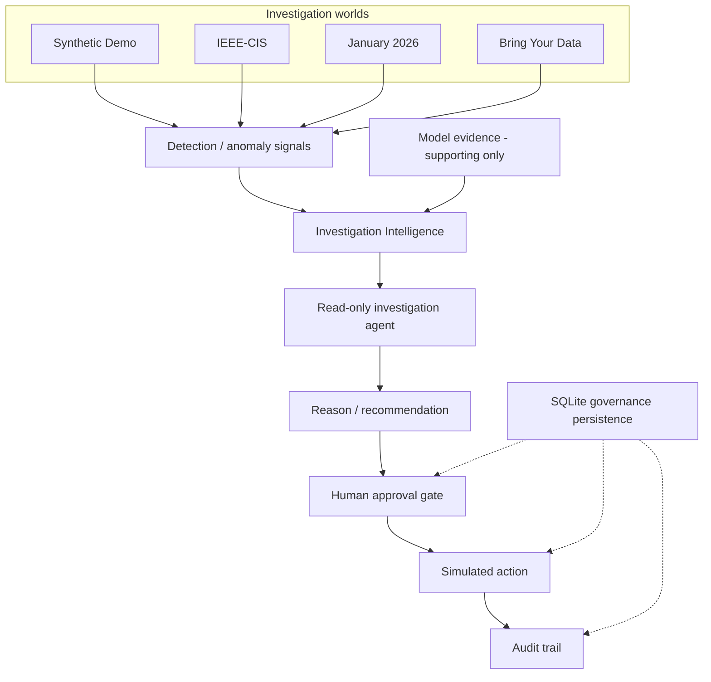

# RIXO

**Risk Intelligence & eXecution Operations** — AI-assisted risk investigation and governed response for payment-risk operations.

RIXO is **not** an autonomous fraud blocker. Model output is supporting evidence. Human approval is required before any **simulated** action. No real money is moved.

**DETECT → INVESTIGATE → DECIDE → ACT → VERIFY**

Every investigation world shows a global safety strip ending in **SIMULATED ACTIONS ONLY**.

---

## Overview

A fraud or risk score alone is not enough to act. Payment-risk teams need to know why a window looks abnormal, what evidence supports or contradicts that reading, and what bounded action a human would authorize — without silently blocking live payments.

RIXO is an operator console over four isolated investigation worlds. It combines:

- independent anomaly detection
- model evidence with an explicit quality status
- investigation intelligence and provenance
- a read-only investigation agent
- a human decision
- a mandatory approval gate
- a simulated payment-system action
- a durable audit trail

`ACT` in this repository means a **simulated** action after explicit approval. It does not mean a live payment block.

---

## Why RIXO

Payment-risk operations fail when a dashboard collapses distinct facts into a single score:

- Teams need investigation, not only a probability.
- Anomaly is not fraud.
- A high model score is not confirmed fraud.
- Delayed labels (`isFraud`, user-provided labels) arrive after the decision window.
- Operators need evidence they can challenge, including unavailable identifiers.
- Any action needs governance, simulation, and audit before it can be trusted.

RIXO keeps those distinctions visible. The classifier never authorizes an action. The investigator never executes one.

---

## What RIXO Does

1. **Detect** abnormal activity from live observed fields for that world (volume, amount, concentration, or synthetic coordination signals). Delayed fraud labels are not live detector inputs.
2. **Investigate** the case from cached artifacts — no rescan of raw ledgers.
3. **Combine independent evidence**: anomaly signals plus classifier output marked as supporting evidence (`used_for_action_selection: false`).
4. **Produce a reasoned recommendation** via a deterministic reasoner. An optional LLM narrator is fail-closed and is not the default.
5. **Require human approval.** Simulation before approval is rejected.
6. **Execute only a simulated action.** The Razorpay adapter is TEST / simulation only. If TEST keys are absent, the workflow still completes and records that the sandbox integration is unavailable.
7. **Record the complete audit trail** and restore it from SQLite on restart. Startup is restore-only: it does not re-approve, re-simulate, or call Razorpay.

The investigation agent (`agent/investigator.py`) uses a fixed read-only plan:

1. `inspect_case_metrics`
2. `inspect_temporal_context`
3. `inspect_entities`
4. `inspect_historical_baseline`
5. `inspect_classifier_evidence`

It is not a chatbot and not an autonomous decision-maker. It cannot propose, approve, simulate, or execute. It does not replace `decide_from_investigation()`.

---

## Four Investigation Worlds

Worlds are isolated. They do not share stores, artifacts, or idempotency keys. Results are not comparable as one dataset.

| World | Purpose | Data / behavior |
| --- | --- | --- |
| **Synthetic Demo** (`/`) | Controlled festive vs coordinated-abuse scenario | Seed-42 ledger (`data/transactions.csv`). Attack and festive calendars are scenario constructs. |
| **IEEE-CIS** (`/real`) | Historical public fraud benchmark | Vesta/Kaggle IEEE-CIS. Relative time (`TransactionDT`), no real IPs. `card4` is a proxy. `isFraud` is delayed ground truth only. |
| **January 2026** (`/recent`) | Recent public online-banking export | Zenodo January 2026 collection. Hour-level volume/amount. Classifier metrics are **not calculated**. Source CNN-LSTM probability is not this system's prediction. |
| **Bring Your Data** (`/bring`) | Operator upload | Session-scoped CSV. User labels are evaluation-only. Unmapped identifiers stay unavailable. Not process-durable. |

Global top-strip copy:

| World | Banner |
| --- | --- |
| Synthetic Demo | `DEMO / SIMULATION ENVIRONMENT — SIMULATED ACTIONS ONLY` |
| IEEE-CIS | `REAL PUBLIC DATA — IEEE-CIS — SIMULATED ACTIONS ONLY` |
| January 2026 | `RECENT PUBLIC DATA — January 2026 — SIMULATED ACTIONS ONLY` |
| Bring Your Data | `BRING YOUR DATA — user-provided CSV — local session only — SIMULATED ACTIONS ONLY` |

---

## Architecture

What the diagram emphasizes, and what the code does:

- The classifier and the detector are independent. Classifier output is supporting evidence, not the cause of the anomaly and not an action authorization.
- The investigation agent is read-only.
- Human approval is mandatory. Simulation before approval returns HTTP 409.
- Action is simulation-only (Razorpay TEST adapter after approval).
- Governance state lives in **one** SQLite file behind the existing world stores (`backend/app/persistence.py`, default `data/governance.sqlite`). Rows carry an explicit `world` column. There is no second ActionStore.

More module detail: [docs/architecture.md](docs/architecture.md).

---

## Key Design Principles

- **Human-in-the-loop** — approval is a separate operator step, never automatic.
- **Evidence before action** — a decision records a bounded recommendation from investigation evidence.
- **Independent anomaly signals** — detectors use live observed fields, not delayed labels.
- **Model output as supporting evidence** — statuses include `UNAVAILABLE`, `LIMITED`, `TRANSFERRED`, `CONTEXTUAL`, and `SUPPORTED`.
- **Read-only investigation** — a deterministic five-tool plan, not LLM tool calling.
- **Explicit governance** — Decision → Approval → Simulation → Audit.
- **Simulation before execution** — no live payment, capture, refund, or merchant-account change.
- **Auditability** — structured events per world; IEEE propose can take an optional `idempotency_key`.
- **Labels are not live truth** — `isFraud` / user labels are evaluation overlays.

---

## Disclaimer

RIXO is a risk-investigation and governed-response prototype. All payment actions demonstrated by the application are simulated. No real money is moved and no live payment is blocked or modified.
