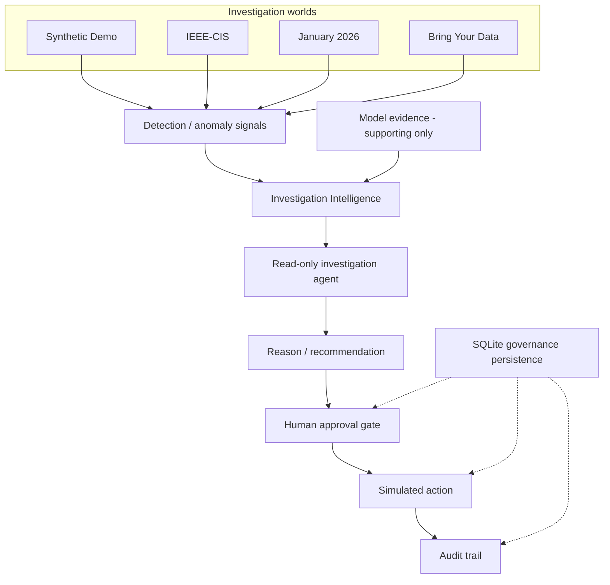

# RIXO

**Risk Intelligence & eXecution Operations** — AI-assisted risk investigation and governed response for payment-risk operations.

RIXO is **not** an autonomous fraud blocker. Model output is supporting evidence. Human approval is required before any **simulated** action. No real money is moved.

**DETECT → INVESTIGATE → DECIDE → ACT → VERIFY**

Every investigation world shows a global safety strip ending in **SIMULATED ACTIONS ONLY**.

---

## Overview

A fraud or risk score alone is not enough to act. Payment-risk teams need to know why a window looks abnormal, what evidence supports or contradicts that reading, and what bounded action a human would authorize — without silently blocking live payments.

RIXO is an operator console over four isolated investigation worlds. It combines:

- independent anomaly detection
- model evidence with an explicit quality status
- investigation intelligence and provenance
- a read-only investigation agent
- a human decision
- a mandatory approval gate
- a simulated payment-system action
- a durable audit trail

`ACT` in this repository means a **simulated** action after explicit approval. It does not mean a live payment block.

---

## Why RIXO

Payment-risk operations fail when a dashboard collapses distinct facts into a single score:

- Teams need investigation, not only a probability.
- Anomaly is not fraud.
- A high model score is not confirmed fraud.
- Delayed labels (`isFraud`, user-provided labels) arrive after the decision window.
- Operators need evidence they can challenge, including unavailable identifiers.
- Any action needs governance, simulation, and audit before it can be trusted.

RIXO keeps those distinctions visible. The classifier never authorizes an action. The investigator never executes one.

---

## What RIXO Does

1. **Detect** abnormal activity from live observed fields for that world (volume, amount, concentration, or synthetic coordination signals). Delayed fraud labels are not live detector inputs.
2. **Investigate** the case from cached artifacts — no rescan of raw ledgers.
3. **Combine independent evidence**: anomaly signals plus classifier output marked as supporting evidence (`used_for_action_selection: false`).
4. **Produce a reasoned recommendation** via a deterministic reasoner. An optional LLM narrator is fail-closed and is not the default.
5. **Require human approval.** Simulation before approval is rejected.
6. **Execute only a simulated action.** The Razorpay adapter is TEST / simulation only. If TEST keys are absent, the workflow still completes and records that the sandbox integration is unavailable.
7. **Record the complete audit trail** and restore it from SQLite on restart. Startup is restore-only: it does not re-approve, re-simulate, or call Razorpay.

The investigation agent (`agent/investigator.py`) uses a fixed read-only plan:

1. `inspect_case_metrics`
2. `inspect_temporal_context`
3. `inspect_entities`
4. `inspect_historical_baseline`
5. `inspect_classifier_evidence`

It is not a chatbot and not an autonomous decision-maker. It cannot propose, approve, simulate, or execute. It does not replace `decide_from_investigation()`.

---

## Four Investigation Worlds

Worlds are isolated. They do not share stores, artifacts, or idempotency keys. Results are not comparable as one dataset.

| World | Purpose | Data / behavior |
| --- | --- | --- |
| **Synthetic Demo** (`/`) | Controlled festive vs coordinated-abuse scenario | Seed-42 ledger (`data/transactions.csv`). Attack and festive calendars are scenario constructs. |
| **IEEE-CIS** (`/real`) | Historical public fraud benchmark | Vesta/Kaggle IEEE-CIS. Relative time (`TransactionDT`), no real IPs. `card4` is a proxy. `isFraud` is delayed ground truth only. |
| **January 2026** (`/recent`) | Recent public online-banking export | Zenodo January 2026 collection. Hour-level volume/amount. Classifier metrics are **not calculated**. Source CNN-LSTM probability is not this system's prediction. |
| **Bring Your Data** (`/bring`) | Operator upload | Session-scoped CSV. User labels are evaluation-only. Unmapped identifiers stay unavailable. Not process-durable. |

Global top-strip copy:

| World | Banner |
| --- | --- |
| Synthetic Demo | `DEMO / SIMULATION ENVIRONMENT — SIMULATED ACTIONS ONLY` |
| IEEE-CIS | `REAL PUBLIC DATA — IEEE-CIS — SIMULATED ACTIONS ONLY` |
| January 2026 | `RECENT PUBLIC DATA — January 2026 — SIMULATED ACTIONS ONLY` |
| Bring Your Data | `BRING YOUR DATA — user-provided CSV — local session only — SIMULATED ACTIONS ONLY` |

---

## Architecture



What the diagram emphasizes, and what the code does:

- The classifier and the detector are independent. Classifier output is supporting evidence, not the cause of the anomaly and not an action authorization.
- The investigation agent is read-only.
- Human approval is mandatory. Simulation before approval returns HTTP 409.
- Action is simulation-only (Razorpay TEST adapter after approval).
- Governance state lives in **one** SQLite file behind the existing world stores (`backend/app/persistence.py`, default `data/governance.sqlite`). Rows carry an explicit `world` column. There is no second ActionStore.

More module detail: [docs/architecture.md](docs/architecture.md).

---

## Key Design Principles

- **Human-in-the-loop** — approval is a separate operator step, never automatic.
- **Evidence before action** — a decision records a bounded recommendation from investigation evidence.
- **Independent anomaly signals** — detectors use live observed fields, not delayed labels.
- **Model output as supporting evidence** — statuses include `UNAVAILABLE`, `LIMITED`, `TRANSFERRED`, `CONTEXTUAL`, and `SUPPORTED`.
- **Read-only investigation** — a deterministic five-tool plan, not LLM tool calling.
- **Explicit governance** — Decision → Approval → Simulation → Audit.
- **Simulation before execution** — no live payment, capture, refund, or merchant-account change.
- **Auditability** — structured events per world; IEEE propose can take an optional `idempotency_key`.
- **Labels are not live truth** — `isFraud` / user labels are evaluation overlays.

---

## Demo / 5-Minute Story

**Story:** AI does not block a payment. AI-assisted evidence supports a governed workflow in which a human authorizes a simulated action.

1. Open IEEE-CIS at `http://localhost:5173/real`.
2. Open representative case `rda-2227` at `http://localhost:5173/real/anomalies/rda-2227`.
3. Show why the hour is abnormal: **748** transactions, **≈ $124,518.75** observed, ProductCD **W ≈ 93.58%**, elevated volume and amount. Detection uses live fields only; `isFraud` was not a live input.
4. Show Investigation Intelligence (Pass 1) — brief, temporal neighbors, provenance, same-world baseline.
5. Show **MODEL EVIDENCE: CONTEXTUAL**. Hour 2227 is an `IN_SAMPLE_MODEL_OVERLAY` (p95 ≈ 0.68, 92 high-risk rows). That is supporting evidence, not held-out accuracy and not production performance. Delayed ground truth on this hour is **7** labelled fraud rows.
6. Show the read-only investigation agent and the five-tool trace.
7. **Record this decision.** The IEEE/BYOD decision path uses anomaly evidence (`decide_from_investigation()`), not classifier `high_risk_count`.
8. Open the **Approval** tab — still gated.
9. **Approve.**
10. **Run dry-run simulation** — Razorpay TEST / no live payment.
11. Open **Audit history** — decision recorded, proposed, approved, simulated.
12. Restart restores this state from SQLite. It does not automatically re-approve or re-simulate.

Optional contrast: Synthetic Festive Case #18 at `http://localhost:5173/investigations/spk-fest-20260114-18` — high volume, transferred classifier status **LIMITED**, recommendation **monitor**. High volume is not treated as coordinated abuse.

---

## Technology Stack

| Layer | Actual stack |
| --- | --- |
| Operator UI | React 19, TypeScript, Vite, Tailwind CSS 4, React Router |
| API | FastAPI, Pydantic Settings, Uvicorn |
| Detection / evaluation | Python, pandas, NumPy |
| Classifier | scikit-learn HistGradientBoosting (`models/ieee_fraud/`) |
| Governance persistence | Python stdlib `sqlite3` |
| Payments demo | Razorpay TEST adapter via `httpx` |
| Tests | pytest, Vitest, Testing Library |

Optional: `LLM_API_KEY` enables a fail-closed narrator. Deterministic investigation is the default. There is no LangGraph/LangChain agent loop.

---

## Running Locally

Prerequisites: **Node.js 20+**, **Python 3.11+**.

Never commit live payment credentials or secrets. `.env` files and `*.sqlite` are gitignored.

### Backend

```powershell
cd backend
python -m venv .venv
.\.venv\Scripts\Activate.ps1
pip install -r requirements.txt
python -m uvicorn app.main:app --reload --port 8000
```

From the repository root:

```powershell
.\backend\.venv\Scripts\python.exe -m uvicorn app.main:app --app-dir backend --reload --port 8000
```

- Health: `http://localhost:8000/health`
- API docs: `http://localhost:8000/docs`

Copy `backend/.env.example` to `backend/.env` only if you need to change:

- `CORS_ORIGINS` (default `http://localhost:5173`)
- `GOVERNANCE_SQLITE_PATH` (default `data/governance.sqlite`)
- `RAZORPAY_KEY_ID` / `RAZORPAY_KEY_SECRET` / `RAZORPAY_MODE=test` — optional TEST keys
- `LLM_API_KEY` — optional; leave empty for deterministic investigation

Never set live Razorpay keys in this project.

### Frontend

```powershell
cd frontend
npm install
npm run dev
```

App: `http://localhost:5173`

| Path | Page |
| --- | --- |
| `/` | Synthetic overview |
| `/investigations/:spikeId` | Synthetic case |
| `/real` / `/real/anomalies/:id` | IEEE-CIS |
| `/recent` / `/recent/anomalies/:id` | January 2026 |
| `/bring` | Bring Your Data |
| `/actions`, `/audit` | Synthetic session / audit views |

Copy `frontend/.env.example` to `frontend/.env` to change `VITE_API_BASE_URL` (default `http://localhost:8000`).

### Tests and production build

From the repository root:

```powershell
.\backend\.venv\Scripts\python.exe -m pytest -q
```

```powershell
cd frontend
npm test
npm run build
```

`npm run build` runs `tsc -b && vite build`.

### Optional synthetic regenerate

```powershell
.\backend\.venv\Scripts\python.exe -m data.generate_dataset
.\backend\.venv\Scripts\python.exe -m detection.run_detection
```

---

## Verification

Last verified in this workspace:

| Check | Result |
| --- | --- |
| Backend (`pytest -q`) | **345 passed** |
| Frontend (`npm test`) | **63 passed** |
| Production build (`tsc -b && vite build`) | **passed** |

These are engineering-suite results, not production accuracy.

---

## Evaluation

Numbers below come from committed artifacts. They are **not** production performance and **not** money saved. Worlds are never scored as one dataset.

**Synthetic detector holdout (seed 2027)** — `data/heldout/detection_metrics.json`

- Any injected scenario vs any spike: precision **0.85**, recall **0.436**
- Coordinated-abuse hours: precision/recall **1.0** (6/6)
- Festive hours predicted as coordinated abuse: **0**

**Synthetic investigation (seed 2027)** — `evaluation/investigation_metrics.json`

- 40 detected spikes, calendar agreement **0.85** (34/40), deterministic reasoner

**IEEE-CIS classifier (chronological test split)** — `data/real/model/model_evaluation.json`

- `isFraud` is the target, not a feature
- Test ranking: PR-AUC **0.461861**, ROC-AUC **0.88697**
- Operating point threshold **0.5**, F1 **0.283946**
- Historical IEEE test results only

**IEEE hour-level detector** — `data/real/evaluation.json`

- Live inputs: hour volume, amount, ProductCD share
- Temporal holdout precision **0.0** against a delayed high-fraud-rate label
- Not the classifier

**January 2026** — `data/real_2026/evaluation.json`

- Classifier metrics are not calculated

Synthetic spike-level scorecard and controlled counterfactual outcome measurement live at `GET /api/evaluation/synthetic` and `POST /api/evaluation/synthetic/counterfactual`. The counterfactual is an in-memory **CONTROLLED SYNTHETIC COUNTERFACTUAL**. IEEE-CIS cannot receive those metrics because no post-intervention ledger exists.

---

## Repository / Data Notes

| Asset | Treatment |
| --- | --- |
| Synthetic seed-42 ledger | Committed under `data/` (`transactions.csv`, hourly windows, detected spikes) |
| Synthetic holdout seed 2027 | Committed under `data/heldout/` |
| IEEE-CIS raw CSVs | **Not redistributed.** `.gitignore` excludes `data/real/**` except derived artifacts and `data/real/README.md`. Obtain `train_transaction.csv` yourself if you have license rights. |
| January 2026 raw export | **Not redistributed.** `.gitignore` excludes the CSV; derived `profile.json`, `anomalies.json`, hourly metrics, and `evaluation.json` may be committed. |
| Governance SQLite | `*.sqlite` is gitignored. Created locally at `data/governance.sqlite`. |
| Secrets | `.env` is gitignored. |

The operator UI reads derived artifacts (`anomalies.json`, hourly metrics, overlays). It does not rescan `train_transaction.csv`, `transactions.csv`, or the January raw export during investigation.

---

## Limitations & Scope

- Actions are **simulation-only**. There is no live Razorpay execution.
- There is no autonomous blocking, capture, refund, or merchant-account mutation.
- No production fraud-reduction, money-saved, or ROI figure is produced.
- Historical and delayed labels are not live truth.
- SQLite persistence is single-process / single-instance.
- Bring Your Data sessions are in-memory and do not survive process restart.
- IEEE `TransactionDT` is relative elapsed time, not a calendar.
- January 2026 has no entity-clustering identifiers.
- Transferred classifier coverage can be very low (`LIMITED`).
- Seed-42 scorecard is in-sample demo evaluation, not the seed-2027 holdout.
- IEEE intervention effectiveness is not measurable as genuine before/after production performance.

---

## Future Roadmap

Not shipped:

- Multi-instance durable storage
- Deeper Razorpay TEST objects
- Deploy / hosting packaging

---

## Out of Scope

- Autonomous action
- Live payment execution
- Chatbot / Ask-AI framing
- Money-saved claims
- A second persistence store or second ActionStore
- Cross-world metric comparison
- LLM tool calling (the deterministic five-tool plan is intentional)

---

## Demo Disclaimer

RIXO is a risk-investigation and governed-response prototype. All payment actions demonstrated by the application are simulated. No real money is moved and no live payment is blocked or modified.
